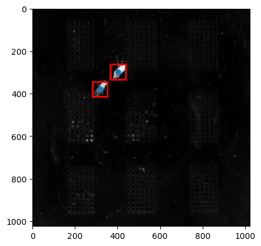

[](https://colab.research.google.com/github/talmolab/dreem/blob/main/examples/dreem-demo.ipynb)

# End-to-end demo

This notebook will walk you through the DREEM pipeline end to end, from obtaining data to training a model, evaluating on a held-out dataset, and visualizing the results. Here, we use the **CLI** for training, tracking, and evaluation; an **Advanced Usage** section shows how to use configuration files for finer control.

To run this demo, we have provided sample data and configurations. The data used in this demo is small enough to be run on a single machine, though a GPU is recommended.

#### Install DREEM and dependencies (Colab only)

```python
# Install uv (fast Python package installer)
%pip install uv

# Install dreem and dependencies using uv
!uv pip install dreem-track huggingface_hub opencv-python-headless

# Install ffmpeg for video export (Colab-specific)
!apt-get install -y ffmpeg
```

```python
import torch
import pandas as pd
import numpy as np
import os
import glob
import imageio
import yaml
from pathlib import Path
from datetime import datetime
import pytorch_lightning as pl
import sleap_io as sio
import matplotlib.pyplot as plt
import h5py
```

Check if a GPU is available. For Apple silicon users, you can run on MPS, but ensure your version of PyTorch is compatible with MPS, and that you have installed the correct version of DREEM. You can also run without a GPU. The demo has been tested on an M3 Macbook Air running only on a CPU.

```python
cuda_available = torch.cuda.is_available()
print(f"CUDA available: {cuda_available}")
if cuda_available:
    accelerator = "cuda"
elif torch.backends.mps.is_available():
    accelerator = "mps"
    devices = 1
else:
    accelerator = "cpu"
print("Using device: ", accelerator)

torch.set_float32_matmul_precision("medium")
```

## Download data

```python
!hf download talmolab/sample-flies --repo-type dataset --local-dir ./data
```

## Training

We just need to specify the data paths and the crop size to train the model. The crop size is the size (in pixels) of the square box we make around the instance. It should be of the order of the size of the instance.

Lets figure out an appropriate crop size. We can do this by loading a frame and experimenting with different sizes. For this data, a crop size of 70 seems appropriate.

```python
crop_size = 70  # Adjust this to see what the bounding box looks like
```

```python
slp_files = glob.glob("./data/train/*.slp")
video_files = glob.glob("./data/train/*.mp4")
labels = sio.load_slp(slp_files[0])
video = imageio.get_reader(video_files[0])
frame = video.get_data(0)
centers = []
for instance in labels[0].instances:
    centers.append(np.nanmean(instance.numpy(), axis=0))
centers = np.array(centers)
plt.imshow(frame)
plt.scatter(centers[:, 0], centers[:, 1])
# Draw a square box centered at each centroid with a given crop size (e.g., 70)
for cx, cy in centers:
    top_left = (int(cx - crop_size // 2), int(cy - crop_size // 2))
    rect = plt.Rectangle(top_left, crop_size, crop_size, linewidth=2, edgecolor='red', facecolor='none')
    plt.gca().add_patch(rect)
plt.show()
```



### That's it! Now we can train the model

```python
!dreem train ./data/train --val-dir ./data/val --crop-size {crop_size}
```

## Tracking
Here we run tracking on a video with **no** ground truth labels using the model we just trained. Note that we're using a command line argument to set the maximum number of tracks to 2 since its a 2 flies dataset. You can run the help command below to see all the options.

```python
!dreem track --help
```

```python
models_dir = "./models/dreem_train"
ckpt_files = glob.glob(os.path.join(models_dir, "*final*.ckpt"))
final_ckpt = ckpt_files[0]  # Pick the first one found
print(f"Using checkpoint: {final_ckpt}")
```

```python
!dreem track ./data/inference --checkpoint {final_ckpt} --output ./results --crop-size {crop_size} --max-tracks 2
```

## Evaluate the tracking results
#### Here we run inference on a video **with** ground truth labels. This enables us to compute metrics for our tracking results.

```python
!dreem eval ./data/test --checkpoint {final_ckpt} --output "./eval-results" --crop-size {crop_size} --max-tracks 2
```

## And we're done!
You can take a look at the tracking metrics in the motmetrics.csv file in the directory you chose to save the results to. Scroll to the bottom to generate a video of the tracking results.

## Advanced Usage
Some advanced training parameters cannot be set through CLI overrides, particularly for training parameters. This section demonstrates the use of configuration files to achieve fine grained control over all training parameters that Pytorch Lightning offers.

#### Setup configuration file
Here we override the default training parameters to use different augmentations, minimum epochs, and optimizer parameters. You can edit these directly in the config file at the path below. Try out some of your own augmentations! We use [Albumentations](https://albumentations.ai/) for augmentations.

```python
train_config_path = "./data/configs/base.yaml"
with open(train_config_path, "r") as f:
    config_yaml = yaml.safe_load(f)
print(yaml.dump(config_yaml, default_flow_style=False))
```

### Train the model with configs

```python
!dreem train ./data/train --val-dir ./data/val --crop-size {crop_size} --config ./data/configs/base.yaml
```

### Run inference with configs

If you want to run tracking with more parameters, it can sometimes be easier to use a config file. Here we use the inference config file. Here, we use max_center_dist, which limits how far each instance is allowed to be frame over frame in order to be considered the same instance, and a confidence threshold to flag low confidence predictions for manual review.

```python
track_config_path = "./data/configs/inference.yaml"
with open(track_config_path, "r") as f:
    config_yaml = yaml.safe_load(f)
print(yaml.dump(config_yaml, default_flow_style=False))
```

```python
!dreem track ./data/inference --checkpoint {final_ckpt} --output ./results --crop-size {crop_size} --config ./data/configs/inference.yaml
```

## Visualize the results

```python
import os
import sleap_io as sio
import pandas as pd
import numpy as np
from create_animation import create_tracking_animation
```

Load the predictions into a dataframe to make an animation

```python
slp_files = sorted(glob.glob("./results/*.slp"))
if not slp_files:
    raise FileNotFoundError("No .slp files found in ./results/. Please check the output directory.")
pred_slp = sio.load_slp(slp_files[0])  # load_slp should accept a list of files
list_frames = []
for lf in pred_slp:
    for instance in lf.instances:
        centroid = np.nanmean(instance.numpy(), axis=0)
        track_id = int(instance.track.name)
        list_frames.append(
            {"frame_id": lf.frame_idx, "track_id": track_id, "centroid": centroid}
        )
df = pd.DataFrame(list_frames)
```

Create and display the animation in the notebook

```python
# Find the video file used for inference
video_dir = "./data/inference"
video_files = [f for f in os.listdir(video_dir) if f.endswith('.mp4')]
video_path = os.path.join(video_dir, video_files[0])
print(f"Video: {video_path}")

# Create the animation
anim = create_tracking_animation(
    video_path=video_path,
    metadata_df=df,
    fps=15,
    marker_size=15,
    max_frames=100
)
```
